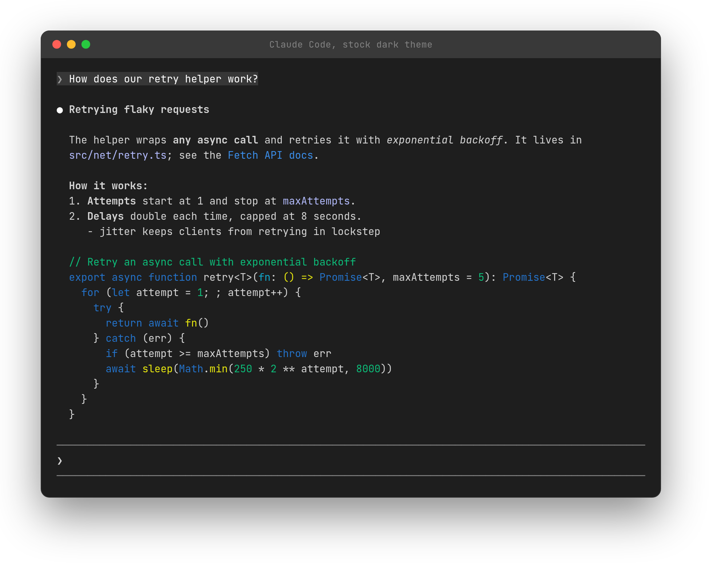
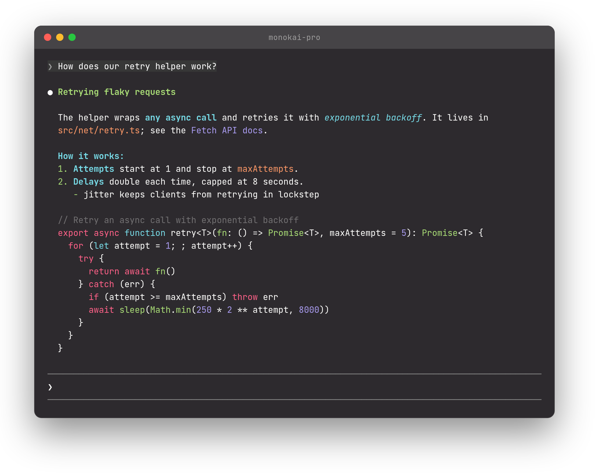
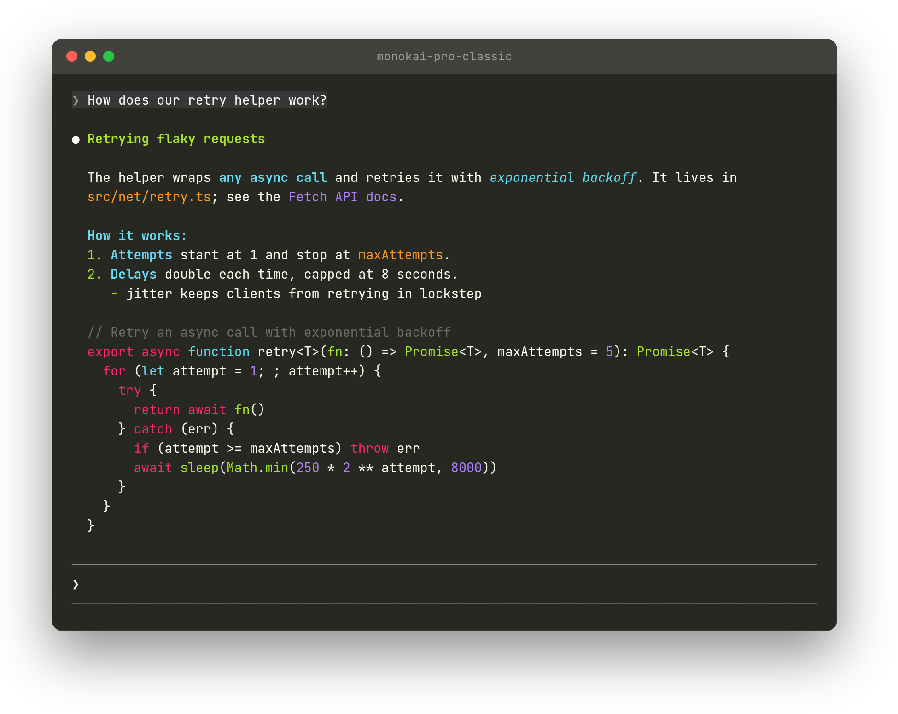
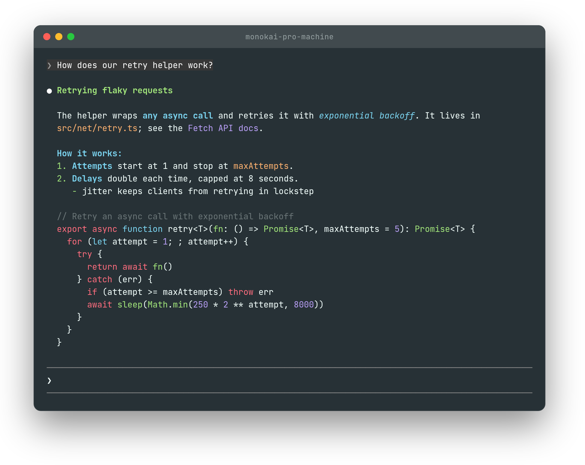
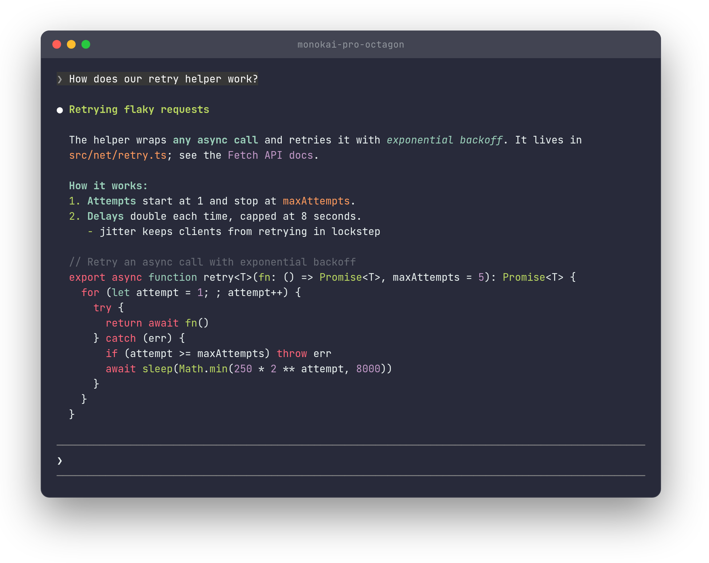
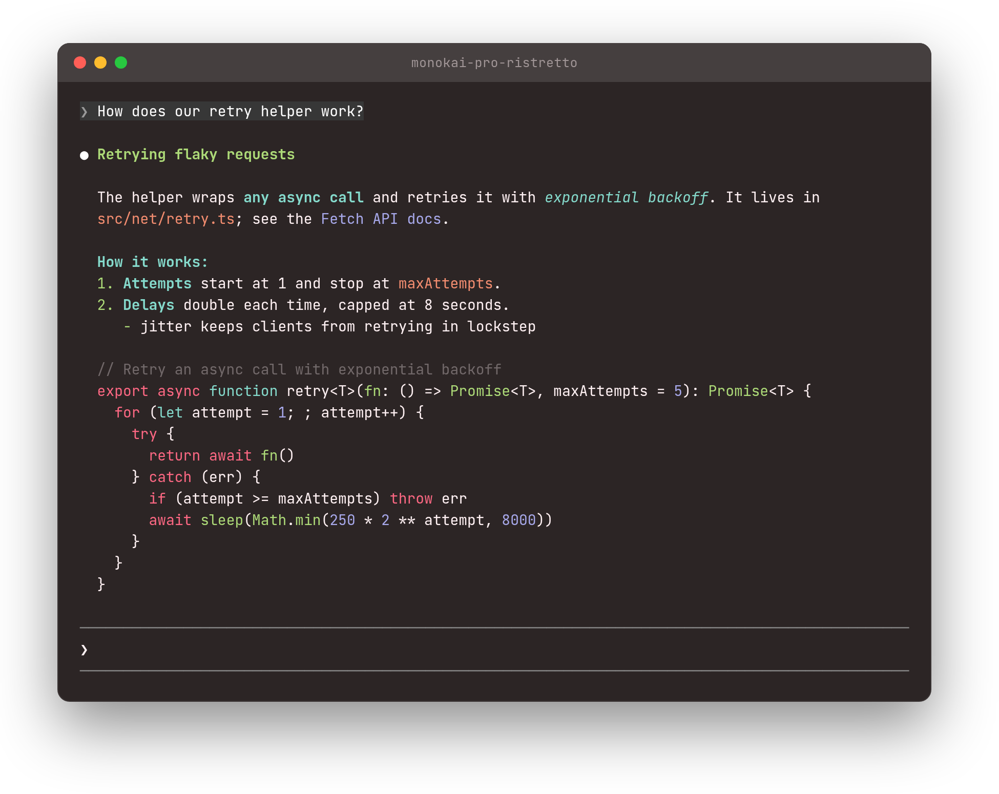
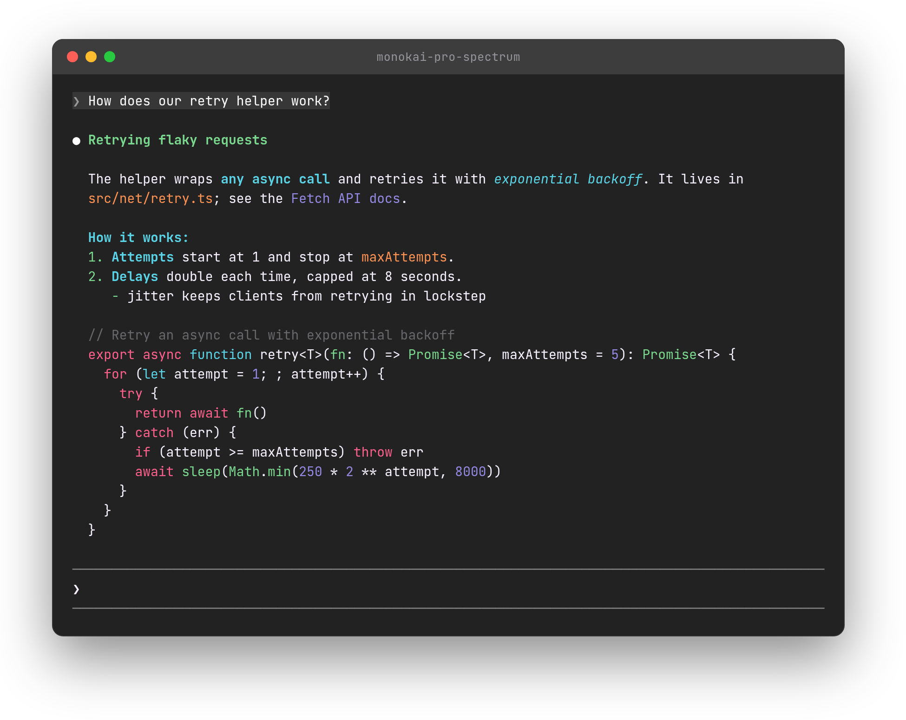

# Claude Code Themes

Monokai Pro colors for Claude Code's replies.

Out of the box, Claude Code draws bold text, italics and headings in the same
color as everything else, and colors code blocks from a fixed set of 16
terminal colors. Its `/theme` setting can't change either. This plugin can.
It's a [mod](https://code.claude.com/docs/en/plugins/mods/overview) that
redraws each reply with a full palette: colored headings and emphasis,
highlighted inline code and links, and Monokai syntax highlighting in code
blocks.

It only changes how replies look. Your saved conversations and what Claude
reads stay exactly the same, and it adds nothing to your token usage.

## Quickstart

Paste this into Claude Code:

```text
Set up Claude Code Themes for me (github.com/danishmughal/claude-code-themes):

1. Check that `claude --version` is 2.1.287 or newer; run `claude update` if not.
2. Run `claude plugin marketplace add danishmughal/claude-code-themes`.
3. Ask me which theme I want: monokai-pro, monokai-pro-classic (the default),
   monokai-pro-machine, monokai-pro-octagon, monokai-pro-ristretto or
   monokai-pro-spectrum.
4. Run `claude plugin install themes@claude-code-themes --config theme=<my pick>`.
5. Tell me to run /reload-plugins.
```

Or install and show your support with a star:

```text
Set up Claude Code Themes for me (github.com/danishmughal/claude-code-themes):

1. Check that `claude --version` is 2.1.287 or newer; run `claude update` if not.
2. Run `claude plugin marketplace add danishmughal/claude-code-themes`.
3. Ask me which theme I want: monokai-pro, monokai-pro-classic (the default),
   monokai-pro-machine, monokai-pro-octagon, monokai-pro-ristretto or
   monokai-pro-spectrum.
4. Run `claude plugin install themes@claude-code-themes --config theme=<my pick>`.
5. Star the repo: `gh api -X PUT user/starred/danishmughal/claude-code-themes`
   (skip this if gh isn't signed in).
6. Tell me to run /reload-plugins.
```

Claude asks which theme you want and installs it. After `/reload-plugins`,
the next reply comes back in color.

## Contents

- [Install](#install)
- [Choose a theme](#choose-a-theme)
- [Themes](#themes)
  - [Claude Code default](#claude-code-default)
  - [monokai-pro](#monokai-pro)
  - [monokai-pro-classic](#monokai-pro-classic)
  - [monokai-pro-machine](#monokai-pro-machine)
  - [monokai-pro-octagon](#monokai-pro-octagon)
  - [monokai-pro-ristretto](#monokai-pro-ristretto)
  - [monokai-pro-spectrum](#monokai-pro-spectrum)
- [Update](#update)
- [Troubleshooting](#troubleshooting)
- [How it works](#how-it-works)
- [Third-party code](#third-party-code)
- [License](#license)

## Install

You need Claude Code 2.1.287 or later, and a terminal that shows full 24-bit
color.

```bash
claude plugin marketplace add danishmughal/claude-code-themes
claude plugin install themes@claude-code-themes
```

This repository is private, so the machine needs GitHub access to it: either
an SSH key loaded in `ssh-agent`, or `gh auth login` followed by
`gh auth setup-git`.

Then start a new session. To confirm the plugin loaded, run `/plugin`; it
shows `1 mod active · themes`.

If the install prints `1 userConfig option not yet set`, that's only the theme
choice. Until you pick one, you get the default, `monokai-pro-classic`.

## Choose a theme

There's one theme for each of the six Monokai Pro palettes. Pick the one that
matches your terminal's theme; Warp includes all six.

Switch anytime with `/plugin configure themes@claude-code-themes` inside
Claude Code, or choose one when you install:

```bash
claude plugin install themes@claude-code-themes --config theme=monokai-pro
```

Every theme colors the same parts of a reply:

| Part of a reply | Color |
| :- | :- |
| Headings and list markers | green |
| Bold and italic text | blue |
| Inline code, and code blocks with no language | orange |
| Link text | purple |
| Code blocks | keywords red, declarations blue, strings yellow, numbers purple, functions and types green, comments gray |

## Themes

Each screenshot is a real Claude Code session showing the same reply, on the
theme's matching terminal background.

### Claude Code default

For comparison, this is a reply without the plugin. Bold is only heavier,
headings are plain, and code uses the terminal's 16 basic colors.



### monokai-pro

The Monokai Pro default, on a warm charcoal background, `#2d2a2e`.

`#ff6188` red · `#fc9867` orange · `#ffd866` yellow · `#a9dc76` green ·
`#78dce8` blue · `#ab9df2` purple



### monokai-pro-classic

The original Monokai colors, on `#272822`. This is the plugin's default.

`#f92672` red · `#fd971f` orange · `#e6db74` yellow · `#a6e22e` green ·
`#66d9ef` blue · `#ae81ff` purple



### monokai-pro-machine

Cooler, brighter colors on a blue-gray background, `#273136`.

`#ff6d7e` red · `#ffb270` orange · `#ffed72` yellow · `#a2e57b` green ·
`#7cd5f1` blue · `#baa0f8` purple



### monokai-pro-octagon

Softer, muted colors on a navy background, `#282a3a`.

`#ff657a` red · `#ff9b5e` orange · `#ffd76d` yellow · `#bad761` green ·
`#9cd1bb` blue · `#c39ac9` purple



### monokai-pro-ristretto

Warm colors on a dark brown background, `#2c2525`.

`#fd6883` red · `#f38d70` orange · `#f9cc6c` yellow · `#adda78` green ·
`#85dacc` blue · `#a8a9eb` purple



### monokai-pro-spectrum

Saturated colors on a neutral gray background, `#222222`.

`#fc618d` red · `#fd9353` orange · `#fce566` yellow · `#7bd88f` green ·
`#5ad4e6` blue · `#948ae3` purple



## Update

```bash
claude plugin update themes@claude-code-themes
```

Or turn on auto-update for this marketplace under **Marketplaces** in
`/plugin`.

## Troubleshooting

- **`/plugin` doesn't list the mod.** Claude Code sessions older than 2.1.287
  save a setting that switches mods off, and newer sessions read it when they
  start. Restart any old sessions, or run `claude -p /cost` once to refresh
  the setting, then open a new session.
- **Another mod also redraws replies.** Only one mod can draw a reply, so turn
  the other one off in `/plugin`.
- **Some parts still look like stock Claude Code.** Tables, quotes, code in a
  language this plugin doesn't include, and the Claude desktop app keep
  Claude Code's own look.

## How it works

The plugin handles one event: Claude Code asking how to draw a reply
(`ui.render` for `AssistantMessage`).

- `hooks/draw.ts` reads the reply with the same markdown parser Claude Code
  uses (marked, with Claude Code's settings), so line breaks, lists, numbering
  and spacing match what Claude Code would draw. It then draws paragraphs,
  lists, headings and code blocks in color.
- `hooks/highlight.ts` highlights code with highlight.js, using the token rules
  of Claude Code's built-in Monokai Extended colors.
- `hooks/palettes.ts` holds the themes. To add one, add an entry there and its
  name to the `options` list in `.claude-plugin/plugin.json`.

To work on the plugin:

```bash
claude --plugin-dir .      # load this checkout; edits reload as you save
claude plugin validate .
claude plugin test
```

## Third-party code

- `hooks/vendor/marked.js` is marked 18.0.14, the `lib/marked.esm.js` file from
  its npm package (MIT, see `hooks/vendor/marked.LICENSE`).
- `hooks/vendor/hljs/` is highlight.js 11.12.0: `es/core.js` and
  `es/languages/<name>.min.js` from `@highlightjs/cdn-assets`, each language
  saved as `<name>.js` (BSD-3-Clause, see `hooks/vendor/hljs/LICENSE`). To add
  a language, copy its file in and register it in `hooks/highlight.ts`.

## License

MIT
