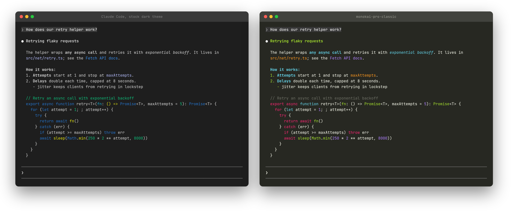

# Claude Code Themes

Color for Claude Code's replies. Claude Code draws bold, italics and headings
as plain weight in the body text color, and highlights code blocks with a
fixed 16-color table; its `/theme` setting reaches neither. This plugin is a
[mod](https://code.claude.com/docs/en/plugins/mods/overview) that redraws each
reply in a Monokai Pro palette:



| In a reply | Color |
| :- | :- |
| Headings, list markers | green |
| Bold, italic | blue |
| Inline code, code blocks with no language | orange |
| Link text | purple |
| Code blocks | Monokai: keywords red, declarations blue, strings yellow, numbers purple, functions and types green, comments gray |

It only changes what's drawn. The saved transcript and what Claude reads are
untouched, and it adds no tokens to any request.

## Contents

- [Install](#install)
- [Pick a theme](#pick-a-theme)
- [Themes](#themes)
  - [monokai-pro](#monokai-pro)
  - [monokai-pro-classic](#monokai-pro-classic)
  - [monokai-pro-machine](#monokai-pro-machine)
  - [monokai-pro-octagon](#monokai-pro-octagon)
  - [monokai-pro-ristretto](#monokai-pro-ristretto)
  - [monokai-pro-spectrum](#monokai-pro-spectrum)
- [Update](#update)
- [If replies aren't colored](#if-replies-arent-colored)
- [How it works](#how-it-works)
- [Vendored code](#vendored-code)
- [License](#license)

## Install

You need Claude Code 2.1.287 or later and a truecolor terminal.

```bash
claude plugin marketplace add danishmughal/claude-code-themes
claude plugin install themes@claude-code-themes
```

The repository is private, so the machine needs git access to it: a GitHub
SSH key loaded in `ssh-agent`, or `gh auth login` then `gh auth setup-git`.

The install may print `1 userConfig option not yet set`. That's the theme
choice; until you pick one, the default applies. Start a new session.
`/plugin` shows `1 mod active · themes` when it loaded.

## Pick a theme

The default is `monokai-pro-classic`. Use the one that matches your terminal
theme; Warp, iTerm2 and most editors ship a Monokai Pro theme of each name.

| Theme | Red | Orange | Yellow | Green | Blue | Purple |
| :- | :- | :- | :- | :- | :- | :- |
| `monokai-pro` | `#ff6188` | `#fc9867` | `#ffd866` | `#a9dc76` | `#78dce8` | `#ab9df2` |
| `monokai-pro-classic` | `#f92672` | `#fd971f` | `#e6db74` | `#a6e22e` | `#66d9ef` | `#ae81ff` |
| `monokai-pro-machine` | `#ff6d7e` | `#ffb270` | `#ffed72` | `#a2e57b` | `#7cd5f1` | `#baa0f8` |
| `monokai-pro-octagon` | `#ff657a` | `#ff9b5e` | `#ffd76d` | `#bad761` | `#9cd1bb` | `#c39ac9` |
| `monokai-pro-ristretto` | `#fd6883` | `#f38d70` | `#f9cc6c` | `#adda78` | `#85dacc` | `#a8a9eb` |
| `monokai-pro-spectrum` | `#fc618d` | `#fd9353` | `#fce566` | `#7bd88f` | `#5ad4e6` | `#948ae3` |

To change it, run `/plugin configure themes@claude-code-themes` in a session,
or set it when you install:

```bash
claude plugin install themes@claude-code-themes --config theme=monokai-pro
```

## Themes

Each screenshot is a real Claude Code session showing the same reply, on the
theme's own Monokai Pro terminal background. For comparison, here is
[stock Claude Code](docs/screenshots/default.png).

### monokai-pro

The Monokai Pro default, on a warm charcoal background, `#2d2a2e`.


### monokai-pro-classic

The original Monokai colors, on `#272822`. This is the plugin's default.


### monokai-pro-machine

Cooler, brighter colors on a blue-gray background, `#273136`.


### monokai-pro-octagon

Softer, muted colors on a navy background, `#282a3a`.


### monokai-pro-ristretto

Warm colors on a dark brown background, `#2c2525`.


### monokai-pro-spectrum

Saturated colors on a neutral gray background, `#222222`.


## Update

```bash
claude plugin update themes@claude-code-themes
```

Or turn on auto-update for the marketplace under **Marketplaces** in `/plugin`.

## If replies aren't colored

- **`/plugin` shows no active mod.** Sessions on a Claude Code older than
  2.1.287 cache a flag that turns mods off, and newer sessions read it at
  startup. Restart the old sessions, or run `claude -p /cost` once to refresh
  the cache, then start a new session.
- **Another mod redraws replies too.** Only one mod can draw a reply; turn
  the other off in `/plugin`.
- **Some blocks keep Claude Code's look.** Tables, quotes, code in a language
  this plugin doesn't bundle, and the desktop app are left to Claude Code.

## How it works

`hooks/register.ts` handles one event, `ui.render` for `AssistantMessage`.
`hooks/draw.ts` parses the reply with the same markdown lexer Claude Code uses
(marked, with Claude Code's two tokenizer settings), so line breaks, list
markers, numbering and spacing match, and draws paragraphs, lists, headings
and code blocks as colored text. `hooks/highlight.ts` highlights code with
highlight.js and the scope rules of Claude Code's own Monokai Extended table.
`hooks/palettes.ts` holds the themes; adding one is a new entry there and in
the `options` list in `.claude-plugin/plugin.json`.

To work on it:

```bash
claude --plugin-dir .      # loads this checkout, reloads on save
claude plugin validate .
claude plugin test
```

## Vendored code

- `hooks/vendor/marked.js`: marked 18.0.14, `lib/marked.esm.js` from the npm
  package (MIT, `hooks/vendor/marked.LICENSE`)
- `hooks/vendor/hljs/`: highlight.js 11.12.0, `es/core.js` and
  `es/languages/<name>.min.js` from `@highlightjs/cdn-assets`, saved as
  `<name>.js` (BSD-3-Clause, `hooks/vendor/hljs/LICENSE`). To add a language,
  copy its file in and register it in `hooks/highlight.ts`.

## License

MIT
